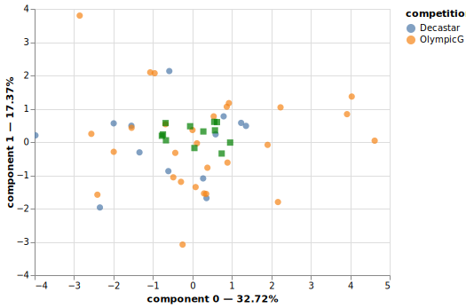
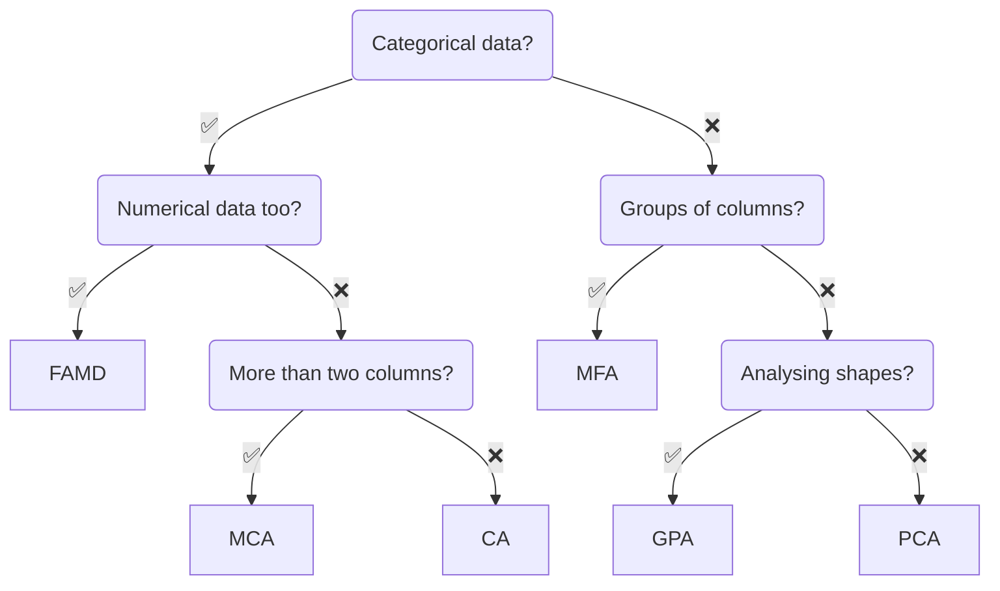

<div align="center">
  
</div>

<br/>

<div align="center">
  <!-- Python version -->
  <a href="https://pypi.python.org/pypi/prince">
    
  </a>
  <!-- PyPi -->
  <a href="https://pypi.org/project/prince/">
    
  </a>
  <!-- PePy -->
  <a href="https://pepy.tech/project/prince">
    
  </a>
  <!-- Build status -->
  <a href="https://travis-ci.org/MaxHalford/prince?branch=master">
    
  </a>
  <!-- License -->
  <a href="https://opensource.org/licenses/MIT">
    
  </a>
</div>

<br/>

Prince is a Python library for multivariate exploratory data analysis in Python. It includes a variety of methods for summarizing tabular data, including [principal component analysis (PCA)](https://www.wikiwand.com/en/Principal_component_analysis) and [correspondence analysis (CA)](https://www.wikiwand.com/en/Correspondence_analysis). Prince provides efficient implementations, using a scikit-learn API.

## Example usage

```py
>>> import prince

>>> dataset = prince.datasets.load_decathlon()
>>> decastar = dataset.query('competition == "Decastar"')

>>> pca = prince.PCA(n_components=5)
>>> pca = pca.fit(decastar, supplementary_columns=['rank', 'points'])
>>> pca.eigenvalues_summary
          eigenvalue % of variance % of variance (cumulative)
component
0              3.114        31.14%                     31.14%
1              2.027        20.27%                     51.41%
2              1.390        13.90%                     65.31%
3              1.321        13.21%                     78.52%
4              0.861         8.61%                     87.13%

>>> pca.transform(dataset).tail()
component                       0         1         2         3         4
competition athlete
OlympicG    Lorenzo      2.070933  1.545461 -1.272104 -0.215067 -0.515746
            Karlivans    1.321239  1.318348  0.138303 -0.175566 -1.484658
            Korkizoglou -0.756226 -1.975769  0.701975 -0.642077 -2.621566
            Uldal        1.905276 -0.062984 -0.370408 -0.007944 -2.040579
            Casarsa      2.282575 -2.150282  2.601953  1.196523 -3.571794

```

```py
>>> chart = pca.plot(dataset)

```

<div align="center">
  
</div>

## Installation

```sh
pip install prince
```

🎨 Prince uses [Altair](https://altair-viz.github.io/) for making charts.

## Methods



### [Principal component analysis (PCA)](docs/PCA.md)
### [Correspondence analysis (CA)](docs/CA.md)
### [Multiple correspondence analysis (MCA)](docs/MCA.md)
### [Multiple factor analysis (MFA)](docs/MFA.md)
### [Factor analysis of mixed data (FAMD)](docs/FAMD.md)
### [Generalized procrustes analysis (GPA)](docs/GPA.md)

## Correctness

Prince is tested against scikit-learn and [FactoMineR](http://factominer.free.fr/). For the latter, [rpy2](https://rpy2.github.io/) is used to run code in R, and convert the results to Python, which allows running automated tests. See more in the [`tests`](/tests/) directory.

## Citation

Please use this citation if you use this software as part of a scientific publication.

```bibtex
@software{Halford_Prince,
    author = {Halford, Max},
    license = {MIT},
    title = {{Prince}},
    url = {https://github.com/MaxHalford/prince}
}
```

## Support

I made Prince when I was at university, back in 2016. I've had very little time over the years to maintain this package. I spent a significant of time in 2022 to revamp the entire package. Prince has now been downloaded over [1 million times](https://pepy.tech/project/prince). I would be grateful to anyone willing to [sponsor](https://github.com/sponsors/MaxHalford) me. Sponsorships allow me to spend more time working on open source software, including Prince.

## License

The MIT License (MIT). Please see the [license file](LICENSE) for more information.
