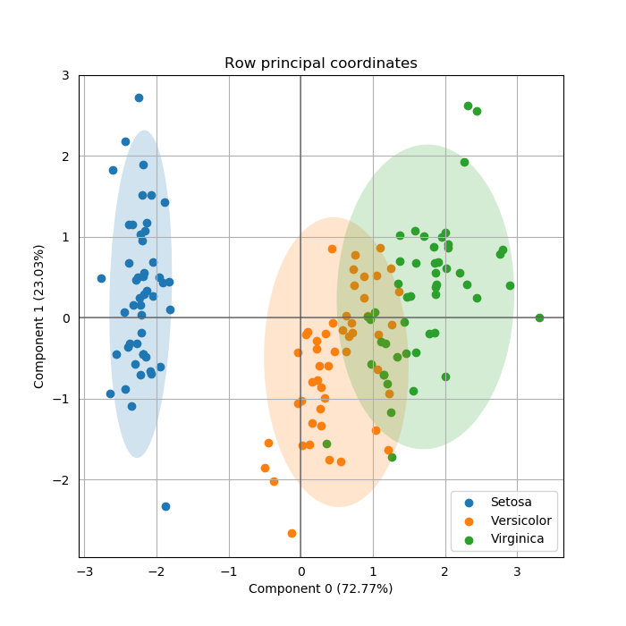

<div align="center">
  
</div>

<br/>

<div align="center">
  <!-- Python version -->
  <a href="https://pypi.python.org/pypi/prince">
    
  </a>
  <!-- PyPi -->
  <a href="https://pypi.org/project/prince/">
    
  </a>
  <!-- Build status -->
  <a href="https://travis-ci.org/MaxHalford/Prince?branch=master">
    
  </a>
  <!-- Test coverage -->
  <a href="https://coveralls.io/github/MaxHalford/Prince?branch=master">
    
  </a>
  <!-- License -->
  <a href="https://opensource.org/licenses/MIT">
    
  </a>
</div>

<br/>

## Introduction

Prince is a library for doing [factor analysis](https://www.wikiwand.com/en/Factor_analysis). This includes a variety of methods including [principal component analysis (PCA)](https://www.wikiwand.com/en/Principal_component_analysis) (PCA) and [correspondance analysis (CA)](https://www.wikiwand.com/en/Correspondence_analysis). The goal is to provide an efficient implementation for each algorithm along with a nice API.

## Installation

:warning: Prince is only compatible with Python 3

:snake: Although it isn't a requirement, using [Anaconda](https://www.continuum.io/downloads) is highly recommended.

**Via PyPI**

```sh
>>> pip install prince  # doctest: +SKIP
```

**Via GitHub for the latest development version**

```sh
>>> pip install git+https://github.com/MaxHalford/Prince  # doctest: +SKIP
```

Prince doesn't have any extra dependencies apart from the usual suspects (`sklearn`, `pandas`, `matplotlib`) which are included with Anaconda.

## Usage

### Guidelines

Under the hood Prince uses a [randomised version of SVD](https://research.fb.com/fast-randomized-svd/). This is extremely faster than using the classical approach. However the results may have a small inherent randomness. For most applications this doesn't matter and you shouldn't have to worry about it. However if you want reproducible results then you should set your random number generator's seed:

```sh
>>> import numpy as np
>>> np.random.seed(42)

```

The randomised version of SVD is an iterative method. Because each of Prince's algorithms use SVD, they all possess a `n_iter` parameter which controls the number of iterations used for computing the SVD. On the one hand the higher `n_iter` is the more precise the results will be. On the other hand increasing `n_iter` increases the computation time. In general the algorithm converges very quickly so using a low `n_iter` (which is the default behaviour) is recommended.

The following papers give a good overview of the field of factor analysis if you want to go deeper:

- [A Tutorial on Principal Component Analysis](https://arxiv.org/pdf/1404.1100.pdf)
- [Theory of Correspondence Analysis](http://statmath.wu.ac.at/courses/CAandRelMeth/caipA.pdf)
- [Finding structure with randomness: Probabilistic algorithms for constructing approximate matrix decompositions](https://arxiv.org/pdf/0909.4061.pdf)
- [Computation of Multiple Correspondence Analysis, with code in R](https://core.ac.uk/download/pdf/6591520.pdf)
- [Singular Value Decomposition Tutorial](https://davetang.org/file/Singular_Value_Decomposition_Tutorial.pdf)

### Principal component analysis (PCA)

If you're using PCA it is assumed you have a dataframe consisting of numerical variables. In this example we're going to be using the [Iris flower dataset](https://www.wikiwand.com/en/Iris_flower_data_set).

```sh
>>> import pandas as pd
>>> import prince
>>> from sklearn import datasets

>>> X, y = datasets.load_iris(return_X_y=True)
>>> X = pd.DataFrame(data=X, columns=['Sepal length', 'Sepal width', 'Petal length', 'Sepal length'])
>>> y = pd.Series(y).map({0: 'Setosa', 1: 'Versicolor', 2: 'Virginica'})
>>> X.head()
   Sepal length  Sepal width  Petal length  Sepal length
0           5.1          3.5           1.4           0.2
1           4.9          3.0           1.4           0.2
2           4.7          3.2           1.3           0.2
3           4.6          3.1           1.5           0.2
4           5.0          3.6           1.4           0.2

```

The `prince.PCA` supports scikit-learn's `fit`/`transform` API. It's parameters have to passed at initialisation before calling the `fit` method.

```sh
>>> pca = prince.PCA(
...     n_components=2,
...     n_iter=3,
...     rescale_with_mean=True,
...     rescale_with_std=True,
...     copy=True,
...     engine='auto'
... )
>>> pca = pca.fit(X)

```

The available parameters are:

- `n_components`: the number of components that are computed. You only need two if your intention is to make a chart.
- `n_iter`: the number of iterations used for computing the SVD
- `rescale_with_mean`: whether to substract each column's mean
- `rescale_with_stds`: whether to divide each column by it's standard deviation
- `copy`: if `False` then the computations will be done inplace which can have possible side-effects on the input data
- `engine`: what SVD engine to use (should be one of `['auto', 'fbpca', 'sklearn']`)

Once the `PCA` has been fitted, it can be used to extract the row principal coordinates as so:

```sh
>>> pca.transform(X).head()  # Same as pca.row_principal_coordinates(X).head()
          0         1
0 -2.264542  0.505704
1 -2.086426 -0.655405
2 -2.367950 -0.318477
3 -2.304197 -0.575368
4 -2.388777  0.674767

```

Each column stands for a principal component whilst each row stands a row in the original dataset. You can display these projections with the `plot_row_principal_coordinates` method:

```sh
>>> ax = pca.plot_row_principal_coordinates(
...     X,
...     ax=None,
...     figsize=(7, 7),
...     x_component=0,
...     y_component=1,
...     labels=None,
...     group_labels=y,
...     ellipse_outline=False,
...     ellipse_fill=True,
...     show_points=True
... )
>>> ax.get_figure().savefig('images/row_principal_coordinates.png')

```

<div align="center">
  
</div>

### Correspondance analysis (CA)

### Multiple correspondance analysis (CA)

## Going faster

By default `prince` uses `sklearn`'s SVD implementation (the one used under the hood for [`TruncatedSVD`](http://scikit-learn.org/stable/modules/generated/sklearn.decomposition.TruncatedSVD.html)). One of the goals of Prince is to make it possible to use a different SVD backend. For the while the only other supported backend is [Facebook's randomized SVD implementation](https://research.facebook.com/blog/fast-randomized-svd/) called [fbpca](http://fbpca.readthedocs.org/en/latest/). You can use it by setting the `engine` parameter to `'fbpca'`:

```sh
>>> import prince
>>> pca = prince.PCA(engine='fbpca')

```

If you are using Anaconda then you should be able to install `fbpca` without any pain by running `pip install fbpca`.

## Incoming features

I've got a lot on my hands aside from `prince`, so feel free to give me a hand!

- [Factor Analysis of Mixed Data (FAMD)](https://www.wikiwand.com/en/Factor_analysis_of_mixed_data)
- [Generalized Procustean Analysis (GPA)](https://www.wikiwand.com/en/Generalized_Procrustes_analysis)
- [Multiple Factorial Analysis (MFA)](https://www.wikiwand.com/en/Multiple_factor_analysis)

## License

The MIT License (MIT). Please see the [license file](LICENSE) for more information.
