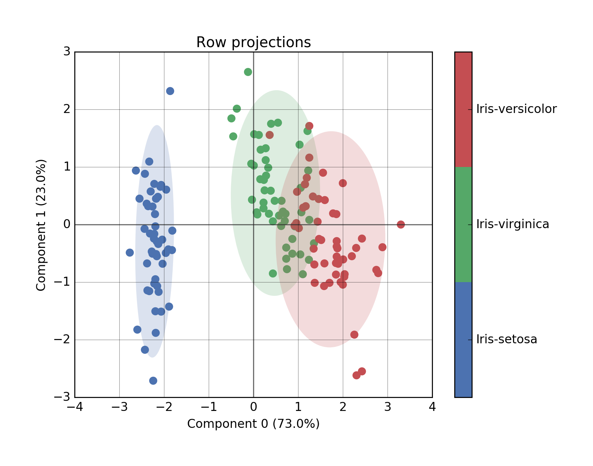
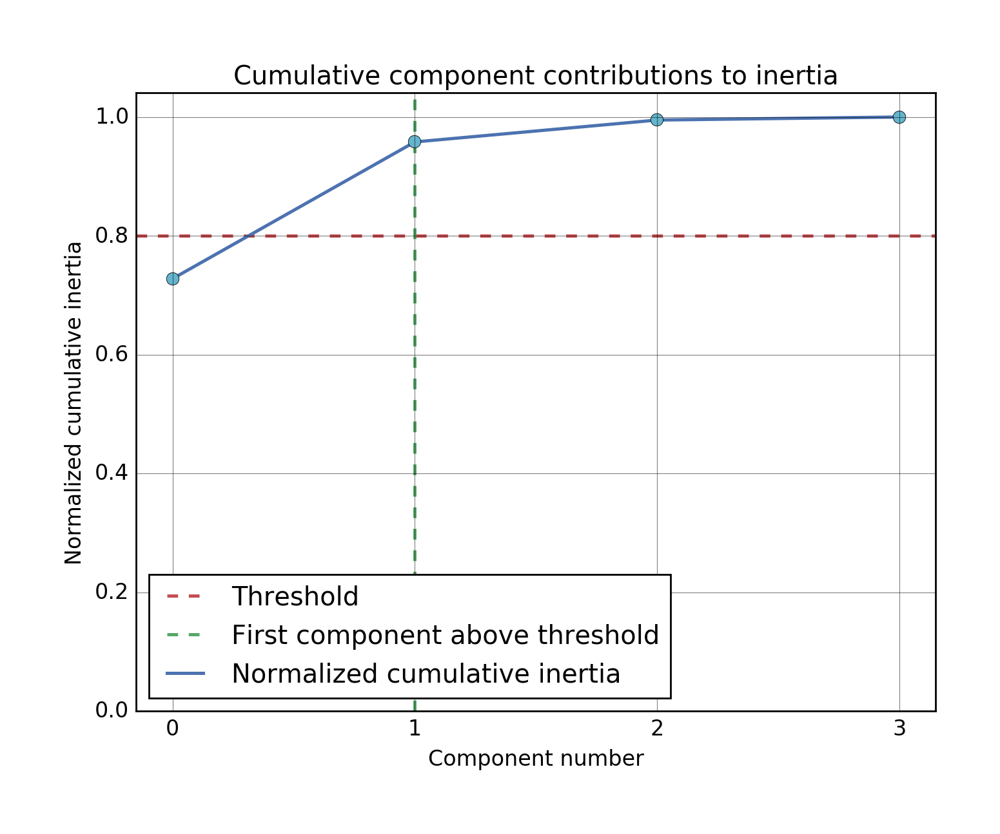

<div align="center">
  
</div>

<br/>

<div align="center">
  <!-- Read the Docs -->
  <a href='http://prince.readthedocs.io/en/latest/?badge=latest'>
    
  </a>
  <!-- PyPi version -->
  <a href="https://badge.fury.io/py/prince">
    
  </a>
  <!-- Build status -->
  <a href="https://travis-ci.org/MaxHalford/Prince?branch=master">
    
  </a>
  <!-- Test coverage -->
  <a href="https://coveralls.io/github/MaxHalford/Prince?branch=master">
    
  </a>
  <!-- Code Climate -->
  <a href="https://codeclimate.com/github/MaxHalford/Prince">
    
  </a>
  <!-- Requirements -->
  <a href="https://requires.io/github/MaxHalford/Prince/requirements/?branch=master">
    
  </a>
  <!-- License -->
  <a href="https://opensource.org/licenses/MIT">
    
  </a>
</div>

<br/>

<br/>
<div align="center">Prince is an easy-to-use factor analysis library</div>
<br/>


## Quick start

Prince uses [pandas](http://pandas.pydata.org/) to manipulate dataframes, as such it expects an initial dataframe to work with. In the following example, a [Principal Component Analysis (PCA)](https://www.wikiwand.com/en/Principal_component_analysis) is applied to the iris dataset. Under the hood Prince decomposes the dataframe into two eigenvector matrices and one eigenvalue array thanks to a [Singular Value Decomposition (SVD)](https://www.wikiwand.com/en/Singular_value_decomposition). The eigenvectors can then be used to project the initial dataset onto lower dimensions.

```python
import matplotlib.pyplot as plt
import pandas as pd

import prince


df = pd.read_csv('data/iris.csv')

pca = prince.PCA(df, n_components=4)

fig1, ax1 = pca.plot_cumulative_inertia()
fig2, ax2 = pca.plot_rows(color_by='class', ellipse_fill=True)

plt.show()
```

The first plot displays the rows in the initial dataset projected on to the two first right eigenvectors (the obtained projections are called principal coordinates). The ellipses are 90% confidence intervals.



The second plot displays the cumulative contributions of each eigenvector (by looking at the corresponding eigenvalues). In this case the total contribution is above 95% while only considering the two first eigenvectors.




## Installation

Prince is only compatible with Python 3. Although it isn't a requirement, using [Anaconda](https://www.continuum.io/downloads) is recommended as it is generally a good idea for doing data science in Python.

**Via PyPI**

```sh
>>> pip install prince
```

**Via GitHub for the latest development version**

```sh
>>> pip install git+https://github.com/MaxHalford/Prince
```

Prince has the following dependencies:

- [pandas](http://pandas.pydata.org/) for manipulating dataframes
- [matplotlib](http://matplotlib.org/) as a default plotting backend
- [fbpca](http://fbpca.readthedocs.org/en/latest/), [Facebook's randomized SVD implementation](https://research.facebook.com/blog/fast-randomized-svd/)


## Documentation

Please check out the [documentation](http://prince.readthedocs.io) for a list of available methods and properties.


## Example usage

You can examples in the `examples/` folder, you have to navigate to the folder to use them.

```sh
>>> cd examples/
>>> python pca-iris.py
```


## License

The MIT License (MIT). Please see the [license file](LICENSE) for more information.
