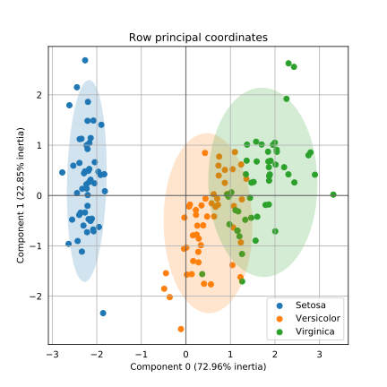
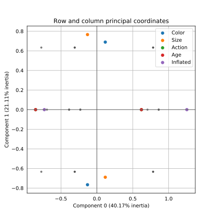
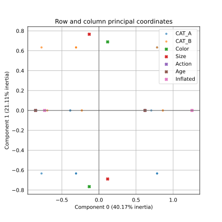
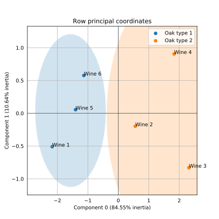
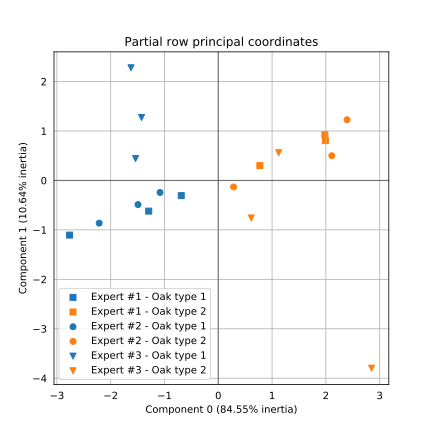
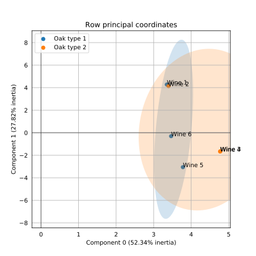
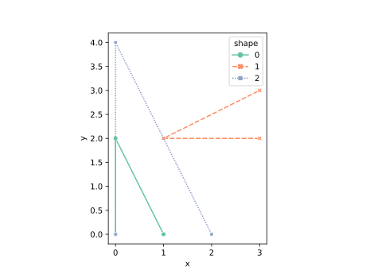
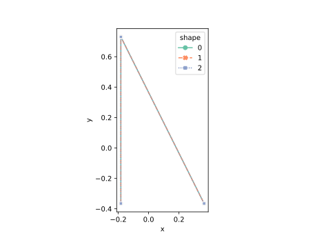

<div align="center">
  
</div>

<br/>

<div align="center">
  <!-- Python version -->
  <a href="https://pypi.python.org/pypi/prince">
    
  </a>
  <!-- PyPi -->
  <a href="https://pypi.org/project/prince/">
    
  </a>
  <!-- Build status -->
  <a href="https://travis-ci.org/MaxHalford/prince?branch=master">
    
  </a>
  <!-- Test coverage -->
  <a href="https://coveralls.io/github/MaxHalford/prince?branch=master">
    
  </a>
  <!-- License -->
  <a href="https://opensource.org/licenses/MIT">
    
  </a>
</div>

<br/>

Prince is a library for doing [factor analysis](https://www.wikiwand.com/en/Factor_analysis). This includes a variety of methods including [principal component analysis (PCA)](https://www.wikiwand.com/en/Principal_component_analysis) and [correspondence analysis (CA)](https://www.wikiwand.com/en/Correspondence_analysis). The goal is to provide an efficient implementation for each algorithm along with a scikit-learn API.

☝️ I made this package when I was a student at university. I have very little time to work on this now that I have a full-time job. Feel to contribute and even take ownership if that sort of thing floats your boat. Thank you in advance for your understanding.

## Table of contents

- [Table of contents](#table-of-contents)
- [Installation](#installation)
- [Usage](#usage)
  - [Guidelines](#guidelines)
  - [Principal component analysis (PCA)](#principal-component-analysis-pca)
  - [Correspondence analysis (CA)](#correspondence-analysis-ca)
  - [Multiple correspondence analysis (MCA)](#multiple-correspondence-analysis-mca)
  - [Multiple factor analysis (MFA)](#multiple-factor-analysis-mfa)
  - [Factor analysis of mixed data (FAMD)](#factor-analysis-of-mixed-data-famd)
  - [Generalized procrustes analysis (GPA)](#generalized-procrustes-analysis-gpa)
- [Going faster](#going-faster)
- [License](#license)

## Installation

:warning: Prince is only compatible with **Python 3**.

:snake: Although it isn't a requirement, using [Anaconda](https://www.continuum.io/downloads) is highly recommended.

**Via PyPI**

```sh
$ pip install prince
```

**Via GitHub for the latest development version**

```sh
$ pip install git+https://github.com/MaxHalford/Prince
```

Prince doesn't have any extra dependencies apart from the usual suspects (`sklearn`, `pandas`, `matplotlib`) which are included with Anaconda.

## Usage

```python
import numpy as np; np.random.set_state(42)  # this is for doctests reproducibility
```

### Guidelines

Each estimator provided by `prince` extends scikit-learn's `TransformerMixin`. This means that each estimator implements a `fit` and a `transform` method which makes them usable in a transformation pipeline. The `fit` method is actually an alias for the `row_principal_components` method which returns the row principal components. However you can also access the column principal components with the `column_principal_components`.

Under the hood Prince uses a [randomised version of SVD](https://research.fb.com/fast-randomized-svd/). This is much faster than using the more commonly full approach. However the results may have a small inherent randomness. For most applications this doesn't matter and you shouldn't have to worry about it. However if you want reproducible results then you should set the `random_state` parameter.

The randomised version of SVD is an iterative method. Because each of Prince's algorithms use SVD, they all possess a `n_iter` parameter which controls the number of iterations used for computing the SVD. On the one hand the higher `n_iter` is the more precise the results will be. On the other hand increasing `n_iter` increases the computation time. In general the algorithm converges very quickly so using a low `n_iter` (which is the default behaviour) is recommended.

You are supposed to use each method depending on your situation:

- All your variables are numeric: use principal component analysis (`prince.PCA`)
- You have a contingency table: use correspondence analysis (`prince.CA`)
- You have more than 2 variables and they are all categorical: use multiple correspondence analysis (`prince.MCA`)
- You have groups of categorical **or** numerical variables: use multiple factor analysis (`prince.MFA`)
- You have both categorical and numerical variables: use factor analysis of mixed data (`prince.FAMD`)

The next subsections give an overview of each method along with usage information. The following papers give a good overview of the field of factor analysis if you want to go deeper:

- [A Tutorial on Principal Component Analysis](https://arxiv.org/pdf/1404.1100.pdf)
- [Theory of Correspondence Analysis](http://statmath.wu.ac.at/courses/CAandRelMeth/caipA.pdf)
- [Finding structure with randomness: Probabilistic algorithms for constructing approximate matrix decompositions](https://arxiv.org/pdf/0909.4061.pdf)
- [Computation of Multiple Correspondence Analysis, with code in R](https://core.ac.uk/download/pdf/6591520.pdf)
- [Singular Value Decomposition Tutorial](https://davetang.org/file/Singular_Value_Decomposition_Tutorial.pdf)
- [Multiple Factor Analysis](https://www.utdallas.edu/~herve/Abdi-MFA2007-pretty.pdf)

### Principal component analysis (PCA)

If you're using PCA it is assumed you have a dataframe consisting of numerical continuous variables. In this example we're going to be using the [Iris flower dataset](https://www.wikiwand.com/en/Iris_flower_data_set).

```python
>>> import pandas as pd
>>> import prince
>>> from sklearn import datasets

>>> X, y = datasets.load_iris(return_X_y=True)
>>> X = pd.DataFrame(data=X, columns=['Sepal length', 'Sepal width', 'Petal length', 'Petal width'])
>>> y = pd.Series(y).map({0: 'Setosa', 1: 'Versicolor', 2: 'Virginica'})
>>> X.head()
   Sepal length  Sepal width  Petal length  Petal width
0           5.1          3.5           1.4          0.2
1           4.9          3.0           1.4          0.2
2           4.7          3.2           1.3          0.2
3           4.6          3.1           1.5          0.2
4           5.0          3.6           1.4          0.2

```

The `PCA` class implements scikit-learn's `fit`/`transform` API. It's parameters have to passed at initialisation before calling the `fit` method.

```python
>>> pca = prince.PCA(
...     n_components=2,
...     n_iter=3,
...     rescale_with_mean=True,
...     rescale_with_std=True,
...     copy=True,
...     check_input=True,
...     engine='auto',
...     random_state=42
... )
>>> pca = pca.fit(X)

```

The available parameters are:

- `n_components`: the number of components that are computed. You only need two if your intention is to make a chart.
- `n_iter`: the number of iterations used for computing the SVD
- `rescale_with_mean`: whether to subtract each column's mean
- `rescale_with_std`: whether to divide each column by it's standard deviation
- `copy`: if `False` then the computations will be done in place which can have possible side-effects on the input data
- `engine`: what SVD engine to use (should be one of `['auto', 'fbpca', 'sklearn']`)
- `random_state`: controls the randomness of the SVD results.

Once the `PCA` has been fitted, it can be used to extract the row principal coordinates as so:

```python
>>> pca.transform(X).head()  # same as pca.row_coordinates(X).head()
          0         1
0 -2.264703  0.480027
1 -2.080961 -0.674134
2 -2.364229 -0.341908
3 -2.299384 -0.597395
4 -2.389842  0.646835

```

Each column stands for a principal component whilst each row stands a row in the original dataset. You can display these projections with the `plot_row_coordinates` method:

```python
>>> ax = pca.plot_row_coordinates(
...     X,
...     ax=None,
...     figsize=(6, 6),
...     x_component=0,
...     y_component=1,
...     labels=None,
...     color_labels=y,
...     ellipse_outline=False,
...     ellipse_fill=True,
...     show_points=True
... )
>>> ax.get_figure().savefig('images/pca_row_coordinates.svg')

```

<div align="center">
  
</div>

Each principal component explains part of the underlying of the distribution. You can see by how much by using the accessing the `explained_inertia_` property:

```python
>>> pca.explained_inertia_
array([0.72962445, 0.22850762])

```

The explained inertia represents the percentage of the inertia each principal component contributes. It sums up to 1 if the `n_components` property is equal to the number of columns in the original dataset. you The explained inertia is obtained by dividing the eigenvalues obtained with the SVD by the total inertia, both of which are also accessible.

```python
>>> pca.eigenvalues_
array([2.91849782, 0.91403047])

>>> pca.total_inertia_
4.000000...

>>> pca.explained_inertia_
array([0.72962445, 0.22850762])

```

You can also obtain the correlations between the original variables and the principal components.

```python
>>> pca.column_correlations(X)
                     0         1
Petal length  0.991555  0.023415
Petal width   0.964979  0.064000
Sepal length  0.890169  0.360830
Sepal width  -0.460143  0.882716

```

You may also want to know how much each observation contributes to each principal component. This can be done with the `row_contributions` method.

```python
>>> pca.row_contributions(X).head()
          0         1
0  1.757369  0.252098
1  1.483777  0.497200
2  1.915225  0.127896
3  1.811606  0.390447
4  1.956947  0.457748

```

You can also transform row projections back into their original space by using the `inverse_transform` method.

```python
>>> pca.inverse_transform(pca.transform(X)).head()
          0         1         2         3
0  5.018949  3.514854  1.466013  0.251922
1  4.738463  3.030433  1.603913  0.272074
2  4.720130  3.196830  1.328961  0.167414
3  4.668436  3.086770  1.384170  0.182247
4  5.017093  3.596402  1.345411  0.206706

```

### Correspondence analysis (CA)

You should be using correspondence analysis when you want to analyse a contingency table. In other words you want to analyse the dependencies between two categorical variables. The following example comes from section 17.2.3 of [this textbook](http://ce.aut.ac.ir/~shiry/lecture/Advanced%20Machine%20Learning/Manifold_Modern_Multivariate%20Statistical%20Techniques%20-%20Regres.pdf). It shows the number of occurrences between different hair and eye colors.

```python
>>> import pandas as pd

>>> pd.set_option('display.float_format', lambda x: '{:.6f}'.format(x))
>>> X = pd.DataFrame(
...    data=[
...        [326, 38, 241, 110, 3],
...        [688, 116, 584, 188, 4],
...        [343, 84, 909, 412, 26],
...        [98, 48, 403, 681, 85]
...    ],
...    columns=pd.Series(['Fair', 'Red', 'Medium', 'Dark', 'Black']),
...    index=pd.Series(['Blue', 'Light', 'Medium', 'Dark'])
... )
>>> X
        Fair  Red  Medium  Dark  Black
Blue     326   38     241   110      3
Light    688  116     584   188      4
Medium   343   84     909   412     26
Dark      98   48     403   681     85

```

Unlike the `PCA` class, the `CA` only exposes scikit-learn's `fit` method.

```python
>>> import prince
>>> ca = prince.CA(
...     n_components=2,
...     n_iter=3,
...     copy=True,
...     check_input=True,
...     engine='auto',
...     random_state=42
... )
>>> X.columns.rename('Hair color', inplace=True)
>>> X.index.rename('Eye color', inplace=True)
>>> ca = ca.fit(X)

```

The parameters and methods overlap with those proposed by the `PCA` class.

```python
>>> ca.row_coordinates(X)
               0         1
Blue   -0.400300 -0.165411
Light  -0.440708 -0.088463
Medium  0.033614  0.245002
Dark    0.702739 -0.133914

>>> ca.column_coordinates(X)
               0         1
Fair   -0.543995 -0.173844
Red    -0.233261 -0.048279
Medium -0.042024  0.208304
Dark    0.588709 -0.103950
Black   1.094388 -0.286437

```

You can plot both sets of principal coordinates with the `plot_coordinates` method.

```python
>>> ax = ca.plot_coordinates(
...     X=X,
...     ax=None,
...     figsize=(6, 6),
...     x_component=0,
...     y_component=1,
...     show_row_labels=True,
...     show_col_labels=True
... )
>>> ax.get_figure().savefig('images/ca_coordinates.svg')

```

<div align="center">
  
</div>

Like for the `PCA` you can access the inertia contribution of each principal component as well as the eigenvalues and the total inertia.

```python
>>> ca.eigenvalues_
[0.199244..., 0.030086...]

>>> ca.total_inertia_
0.230191...

>>> ca.explained_inertia_
[0.865562..., 0.130703...]

```

### Multiple correspondence analysis (MCA)

Multiple correspondence analysis (MCA) is an extension of correspondence analysis (CA). It should be used when you have more than two categorical variables. The idea is simply to compute the one-hot encoded version of a dataset and apply CA on it. As an example we're going to use the [balloons dataset](https://archive.ics.uci.edu/ml/machine-learning-databases/balloons/) taken from the [UCI datasets website](https://archive.ics.uci.edu/ml/datasets.html).

```python
>>> import pandas as pd

>>> X = pd.read_csv('https://archive.ics.uci.edu/ml/machine-learning-databases/balloons/adult+stretch.data')
>>> X.columns = ['Color', 'Size', 'Action', 'Age', 'Inflated']
>>> X.head()
    Color   Size   Action    Age Inflated
0  YELLOW  SMALL  STRETCH  ADULT        T
1  YELLOW  SMALL  STRETCH  CHILD        F
2  YELLOW  SMALL      DIP  ADULT        F
3  YELLOW  SMALL      DIP  CHILD        F
4  YELLOW  LARGE  STRETCH  ADULT        T

```

The `MCA` also implements the `fit` and `transform` methods.

```python
>>> import prince
>>> mca = prince.MCA(
...     n_components=2,
...     n_iter=3,
...     copy=True,
...     check_input=True,
...     engine='auto',
...     random_state=42
... )
>>> mca = mca.fit(X)

```

Like the `CA` class, the `MCA` class also has `plot_coordinates` method.

```python
>>> ax = mca.plot_coordinates(
...     X=X,
...     ax=None,
...     figsize=(6, 6),
...     show_row_points=True,
...     row_points_size=10,
...     show_row_labels=False,
...     row_groups=None,
...     show_column_points=True,
...     column_points_size=30,
...     show_column_labels=False,
...     legend_n_cols=1
... )
>>> ax.get_figure().savefig('images/mca_coordinates.svg')

```

<div align="center">
  
</div>

The optional parameter `row_groups` takes a list of labels for coloring the observations. This list must have the same length than the amount of observations. If no list of labels is passed, then all observations are grey.

```python
>>> groups = ['CAT_A']*10+['CAT_B']*9
>>> ax = mca.plot_coordinates(
...     X=X,
...     ax=None,
...     figsize=(6, 6),
...     show_row_points=True,
...     row_points_size=10,
...     show_row_labels=False,
...     row_groups=groups,
...     show_column_points=True,
...     column_points_size=30,
...     show_column_labels=False,
...     legend_n_cols=1
... )
>>> ax.get_figure().savefig('images/mca_coordinates_with_groups.svg')

```

<div align="center">
  
</div>

The eigenvalues and inertia values are also accessible.

```python
>>> mca.eigenvalues_
[0.401656..., 0.211111...]

>>> mca.total_inertia_
1.0

>>> mca.explained_inertia_
[0.401656..., 0.211111...]

```


### Multiple factor analysis (MFA)

Multiple factor analysis (MFA) is meant to be used when you have groups of variables. In practice it builds a PCA on each group -- or an MCA, depending on the types of the group's variables. It then constructs a global PCA on the results of the so-called partial PCAs -- or MCAs. The dataset used in the following examples come from [this paper](https://www.utdallas.edu/~herve/Abdi-MFA2007-pretty.pdf). In the dataset, three experts give their opinion on six different wines. Each opinion for each wine is recorded as a variable. We thus want to consider the separate opinions of each expert whilst also having a global overview of each wine. MFA is the perfect fit for this kind of situation.

First of all let's copy the data used in the paper.

```python
>>> import pandas as pd

>>> X = pd.DataFrame(
...     data=[
...         [1, 6, 7, 2, 5, 7, 6, 3, 6, 7],
...         [5, 3, 2, 4, 4, 4, 2, 4, 4, 3],
...         [6, 1, 1, 5, 2, 1, 1, 7, 1, 1],
...         [7, 1, 2, 7, 2, 1, 2, 2, 2, 2],
...         [2, 5, 4, 3, 5, 6, 5, 2, 6, 6],
...         [3, 4, 4, 3, 5, 4, 5, 1, 7, 5]
...     ],
...     columns=['E1 fruity', 'E1 woody', 'E1 coffee',
...              'E2 red fruit', 'E2 roasted', 'E2 vanillin', 'E2 woody',
...              'E3 fruity', 'E3 butter', 'E3 woody'],
...     index=['Wine {}'.format(i+1) for i in range(6)]
... )
>>> X['Oak type'] = [1, 2, 2, 2, 1, 1]

```

The groups are passed as a dictionary to the `MFA` class.

```python
>>> groups = {
...    'Expert #{}'.format(no+1): [c for c in X.columns if c.startswith('E{}'.format(no+1))]
...    for no in range(3)
... }
>>> import pprint
>>> pprint.pprint(groups)
{'Expert #1': ['E1 fruity', 'E1 woody', 'E1 coffee'],
 'Expert #2': ['E2 red fruit', 'E2 roasted', 'E2 vanillin', 'E2 woody'],
 'Expert #3': ['E3 fruity', 'E3 butter', 'E3 woody']}

```

Now we can fit an `MFA`.

```python
>>> import prince
>>> mfa = prince.MFA(
...     groups=groups,
...     n_components=2,
...     n_iter=3,
...     copy=True,
...     check_input=True,
...     engine='auto',
...     random_state=42
... )
>>> mfa = mfa.fit(X)

```

The `MFA` inherits from the `PCA` class, which entails that you have access to all it's methods and properties. The `row_coordinates` method will return the global coordinates of each wine.

```python
>>> mfa.row_coordinates(X)
               0         1
Wine 1 -2.172155 -0.508596
Wine 2  0.557017 -0.197408
Wine 3  2.317663 -0.830259
Wine 4  1.832557  0.905046
Wine 5 -1.403787  0.054977
Wine 6 -1.131296  0.576241

```

Just like for the `PCA` you can plot the row coordinates with the `plot_row_coordinates` method.

```python
>>> ax = mfa.plot_row_coordinates(
...     X,
...     ax=None,
...     figsize=(6, 6),
...     x_component=0,
...     y_component=1,
...     labels=X.index,
...     color_labels=['Oak type {}'.format(t) for t in X['Oak type']],
...     ellipse_outline=False,
...     ellipse_fill=True,
...     show_points=True
... )
>>> ax.get_figure().savefig('images/mfa_row_coordinates.svg')

```

<div align="center">
  
</div>

You can also obtain the row coordinates inside each group. The `partial_row_coordinates` method returns a `pandas.DataFrame` where the set of columns is a `pandas.MultiIndex`. The first level of indexing corresponds to each specified group whilst the nested level indicates the coordinates inside each group.

```python
>>> mfa.partial_row_coordinates(X)  # doctest: +NORMALIZE_WHITESPACE
  Expert #1           Expert #2           Expert #3
               0         1         0         1         0         1
Wine 1 -2.764432 -1.104812 -2.213928 -0.863519 -1.538106  0.442545
Wine 2  0.773034  0.298919  0.284247 -0.132135  0.613771 -0.759009
Wine 3  1.991398  0.805893  2.111508  0.499718  2.850084 -3.796390
Wine 4  1.981456  0.927187  2.393009  1.227146  1.123206  0.560803
Wine 5 -1.292834 -0.620661 -1.492114 -0.488088 -1.426414  1.273679
Wine 6 -0.688623 -0.306527 -1.082723 -0.243122 -1.622541  2.278372

```

Likewise you can visualize the partial row coordinates with the `plot_partial_row_coordinates` method.

```python
>>> ax = mfa.plot_partial_row_coordinates(
...     X,
...     ax=None,
...     figsize=(6, 6),
...     x_component=0,
...     y_component=1,
...     color_labels=['Oak type {}'.format(t) for t in X['Oak type']]
... )
>>> ax.get_figure().savefig('images/mfa_partial_row_coordinates.svg')

```

<div align="center">
  
</div>

As usual you have access to inertia information.

```python
>>> mfa.eigenvalues_
array([0.47246678, 0.05947651])

>>> mfa.total_inertia_
0.558834...

>>> mfa.explained_inertia_
array([0.84545097, 0.10642965])

```

You can also access information concerning each partial factor analysis via the `partial_factor_analysis_` attribute.

```python
>>> for name, fa in sorted(mfa.partial_factor_analysis_.items()):
...     print('{} eigenvalues: {}'.format(name, fa.eigenvalues_))
Expert #1 eigenvalues: [0.47709918 0.01997272]
Expert #2 eigenvalues: [0.60851399 0.03235984]
Expert #3 eigenvalues: [0.41341481 0.07353257]

```

The `row_contributions` method will provide you with the inertia contribution of each row with respect to each component.

```python
>>> mfa.row_contributions(X)
               0         1
Wine 1  9.986433  4.349104
Wine 2  0.656699  0.655218
Wine 3 11.369187 11.589968
Wine 4  7.107942 13.771950
Wine 5  4.170915  0.050817
Wine 6  2.708824  5.582943

```

The `column_correlations` method will return the correlation between the original variables and the components.

```python
>>> mfa.column_correlations(X)
                     0         1
E1 coffee    -0.918449 -0.043444
E1 fruity     0.968449  0.192294
E1 woody     -0.984442 -0.120198
E2 red fruit  0.887263  0.357632
E2 roasted   -0.955795  0.026039
E2 vanillin  -0.950629 -0.177883
E2 woody     -0.974649  0.127239
E3 butter    -0.945767  0.221441
E3 fruity     0.594649 -0.820777
E3 woody     -0.992337  0.029747

```


### Factor analysis of mixed data (FAMD)

A description is on it's way. This section is empty because I have to refactor the documentation a bit.

```python
>>> import pandas as pd

>>> X = pd.DataFrame(
...     data=[
...         ['A', 'A', 'A', 2, 5, 7, 6, 3, 6, 7],
...         ['A', 'A', 'A', 4, 4, 4, 2, 4, 4, 3],
...         ['B', 'A', 'B', 5, 2, 1, 1, 7, 1, 1],
...         ['B', 'A', 'B', 7, 2, 1, 2, 2, 2, 2],
...         ['B', 'B', 'B', 3, 5, 6, 5, 2, 6, 6],
...         ['B', 'B', 'A', 3, 5, 4, 5, 1, 7, 5]
...     ],
...     columns=['E1 fruity', 'E1 woody', 'E1 coffee',
...              'E2 red fruit', 'E2 roasted', 'E2 vanillin', 'E2 woody',
...              'E3 fruity', 'E3 butter', 'E3 woody'],
...     index=['Wine {}'.format(i+1) for i in range(6)]
... )
>>> X['Oak type'] = [1, 2, 2, 2, 1, 1]

```

Now we can fit an `FAMD`.

```python
>>> import prince
>>> famd = prince.FAMD(
...     n_components=2,
...     n_iter=3,
...     copy=True,
...     check_input=True,
...     engine='auto',
...     random_state=42
... )
>>> famd = famd.fit(X.drop('Oak type', axis='columns'))

```

The `FAMD` inherits from the `MFA` class, which entails that you have access to all it's methods and properties. The `row_coordinates` method will return the global coordinates of each wine.

```python
>>> famd.row_coordinates(X)
               0         1
Wine 1 -1.488689 -1.002711
Wine 2 -0.449783 -1.354847
Wine 3  1.774255 -0.258528
Wine 4  1.565402  0.016484
Wine 5 -0.349655  1.516425
Wine 6 -1.051531  1.083178

```

Just like for the `MFA` you can plot the row coordinates with the `plot_row_coordinates` method.

```python
>>> ax = famd.plot_row_coordinates(
...     X,
...     ax=None,
...     figsize=(6, 6),
...     x_component=0,
...     y_component=1,
...     labels=X.index,
...     color_labels=['Oak type {}'.format(t) for t in X['Oak type']],
...     ellipse_outline=False,
...     ellipse_fill=True,
...     show_points=True
... )
>>> ax.get_figure().savefig('images/famd_row_coordinates.svg')

```

<div align="center">
  
</div>

### Generalized procrustes analysis (GPA)

Generalized procrustes analysis (GPA) is a shape analysis tool that aligns and scales a set of shapes to a common reference. Here, the term "shape" means an *ordered* sequence of points. GPA iteratively 1) aligns each shape with a reference shape (usually the mean shape), 2) then updates the reference shape, 3) repeating until converged.

Note that the final rotation of the aligned shapes may vary between runs, based on the initialization.

Here is an example aligning a few right triangles:

```python
df = pd.DataFrame(
    data=[
        [0, 0, 0, 0],
        [0, 2, 0, 1],
        [1, 0, 0, 2],
        [3, 2, 1, 0],
        [1, 2, 1, 1],
        [3, 3, 1, 2],
        [0, 0, 2, 0],
        [0, 4, 2, 1],
        [2, 0, 2, 2],
    ],
    columns=['x', 'y', 'shape', 'point']
).astype({'x': float, 'y': float})
fig, ax = plt.subplots()
sns.lineplot(
    data=df,
    x='x',
    y='y',
    hue='shape',
    style='shape',
    palette='Set2',
    markers=True,
    estimator=None,
    sort=False,
    ax=ax
    )
ax.axis('scaled')
fig.savefig('images/gpa_input_triangles.svg')

```

<div align="center">
  
</div>

We need to convert the dataframe to a 3-D numpy array of size (shapes, points, dims).
There are many ways to do this. Here, we use `xarray` as a helper package.

```python
ds = df.set_index(['shape', 'point']).to_xarray()
da = ds.to_stacked_array('xy', ['shape', 'point'])
shapes = da.values
```

Now, we can align the shapes.

```python
import prince
gpa = prince.GPA()
aligned_shapes = gpa.fit_transform(shapes)
```

We then convert the 3-D numpy array to a DataFrame (using `xarray`) for plotting.

```python
da.values = aligned_shapes
df = da.to_unstacked_dataset('xy').to_dataframe().reset_index()
fig, ax = plt.subplots()
sns.lineplot(
    data=df,
    x='x',
    y='y',
    hue='shape',
    style='shape',
    palette='Set2',
    markers=True,
    estimator=None,
    sort=False,
    ax=ax
    )
ax.axis('scaled')
fig.savefig('images/gpa_aligned_triangles.svg')
```

<div align="center">
  
</div>

The triangles were all the same shape, so they are now perfectly aligned.

## Going faster

By default `prince` uses `sklearn`'s randomized SVD implementation (the one used under the hood for [`TruncatedSVD`](http://scikit-learn.org/stable/modules/generated/sklearn.decomposition.TruncatedSVD.html)). One of the goals of Prince is to make it possible to use a different SVD backend. For the while the only other supported backend is [Facebook's randomized SVD implementation](https://research.facebook.com/blog/fast-randomized-svd/) called [fbpca](http://fbpca.readthedocs.org/en/latest/). You can use it by setting the `engine` parameter to `'fbpca'`:

```python
>>> import prince
>>> pca = prince.PCA(engine='fbpca')

```

If you are using Anaconda then you should be able to install `fbpca` without any pain by running `pip install fbpca`.


## License

The MIT License (MIT). Please see the [license file](LICENSE) for more information.
