<div align="center">
  
</div>

<br/>

<div align="center">
  <!-- Python version -->
  <a href="https://pypi.python.org/pypi/prince">
    
  </a>
  <!-- PyPi -->
  <a href="https://pypi.org/project/prince/">
    
  </a>
  <!-- PePy -->
  <a href="https://pepy.tech/project/prince">
    
  </a>
  <!-- Build status -->
  <a href="https://travis-ci.org/MaxHalford/prince?branch=master">
    
  </a>
  <!-- License -->
  <a href="https://opensource.org/licenses/MIT">
    
  </a>
</div>

<br/>

Prince is a library for doing [factor analysis](https://www.wikiwand.com/en/Factor_analysis). This includes a variety of methods for summarizing tabular data, including [principal component analysis (PCA)](https://www.wikiwand.com/en/Principal_component_analysis) and [correspondence analysis (CA)](https://www.wikiwand.com/en/Correspondence_analysis). Prince provides efficient implementations, using a scikit-learn API.

## 2023 update

I made Prince when I was at university, back in 2016. I've had very little time over the years to maintain this package. Now it's 2023, and I have a bit more time. I've revamped the entire package over the past months. There are now unit tests to make sure all the outputs are correct, by comparing to [FactoMineR](http://factominer.free.fr/). Thank you in advance for your understanding, as well as your patience if you've been waiting for this update 🙏

## Example usage

```py
>>> import prince

>>> dataset = prince.datasets.load_decathlon()
>>> decastar = dataset.query('competition == "Decastar"')

>>> pca = prince.PCA(n_components=5)
>>> pca = pca.fit(decastar, supplementary_columns=['rank', 'points'])
>>> pca.eigenvalues_summary
          eigenvalue % of variance % of variance (cumulative)
component
0              3.114        31.14%                     31.14%
1              2.027        20.27%                     51.41%
2              1.390        13.90%                     65.31%
3              1.321        13.21%                     78.52%
4              0.861         8.61%                     87.13%

```

```py
>>> chart = pca.plot(dataset)

```

<div align="center">
  
</div>

## Installation

**Via PyPI**

```sh
pip install prince
```

**Via GitHub for the latest development version**

```sh
pip install git+https://github.com/MaxHalford/Prince
```

🎨 Prince uses [Altair](https://altair-viz.github.io/) for making charts.

## Methods

```mermaid
flowchart TD
    cat?(Categorical data?) --> |"✅"| num_too?(Numerical data too?)
    num_too? --> |"✅"| FAMD
    num_too? --> |"❌"| multiple_cat?(More than two columns?)
    multiple_cat? --> |"✅"| MCA
    multiple_cat? --> |"❌"| CA
    cat? --> |"❌"| groups?(Groups of columns?)
    groups? --> |"✅"| MFA
    groups? --> |"❌"| shapes?(Analysing shapes?)
    shapes? --> |"✅"| GPA
    shapes? --> |"❌"| PCA
```



### [Principal component analysis (PCA)](docs/PCA.md)
### [Correspondence analysis (CA)](docs/CA.md)
### [Multiple correspondence analysis (MCA)](docs/MCA.md)
### [Multiple factor analysis (MFA)](docs/MFA.md)
### [Factor analysis of mixed data (FAMD)](docs/FAMD.md)
### [Generalized procrustes analysis (GPA)](docs/GPA.md)

## Performance

Under the hood Prince uses a [randomised version of SVD](https://research.fb.com/fast-randomized-svd/). This is much faster than using the more commonly full approach. However the results may have a small inherent randomness. For most applications this doesn't matter and you shouldn't have to worry about it. However if you want reproducible results then you should set the `random_state` parameter.

The randomised version of SVD is an iterative method. Because each of Prince's algorithms use SVD, they all possess a `n_iter` parameter which controls the number of iterations used for computing the SVD. On the one hand, the higher `n_iter` is, the more precise the results will be. On the other hand, increasing `n_iter` increases the computation time. In general the algorithm converges very quickly so using a low `n_iter` (which is the default behaviour) is recommended.

By default `prince` uses `sklearn`'s randomized SVD implementation (the one used under the hood for [`TruncatedSVD`](http://scikit-learn.org/stable/modules/generated/sklearn.decomposition.TruncatedSVD.html)). Prince supports different SVD backends. For the while, the only other supported randomized backend is [Facebook's randomized SVD implementation](https://research.facebook.com/blog/fast-randomized-svd/) called [fbpca](http://fbpca.readthedocs.org/en/latest/).

```python
>>> import prince
>>> pca = prince.PCA(engine='fbpca')

```

If you want to use a non-randomized SVD implementation, set the `engine` parameter to `'scipy'`. This will use the [`scipy.linalg.svd` function](https://docs.scipy.org/doc/scipy/reference/generated/scipy.linalg.svd.html).

```python
>>> import prince
>>> pca = prince.PCA(engine='scipy')

```

## Citation

Please use this citation if you use this software as part of a scientific publication.

```bibtex
@software{Halford_Prince,
    author = {Halford, Max},
    license = {MIT},
    title = {{Prince}},
    url = {https://github.com/MaxHalford/prince}
}
```

## License

The MIT License (MIT). Please see the [license file](LICENSE) for more information.
