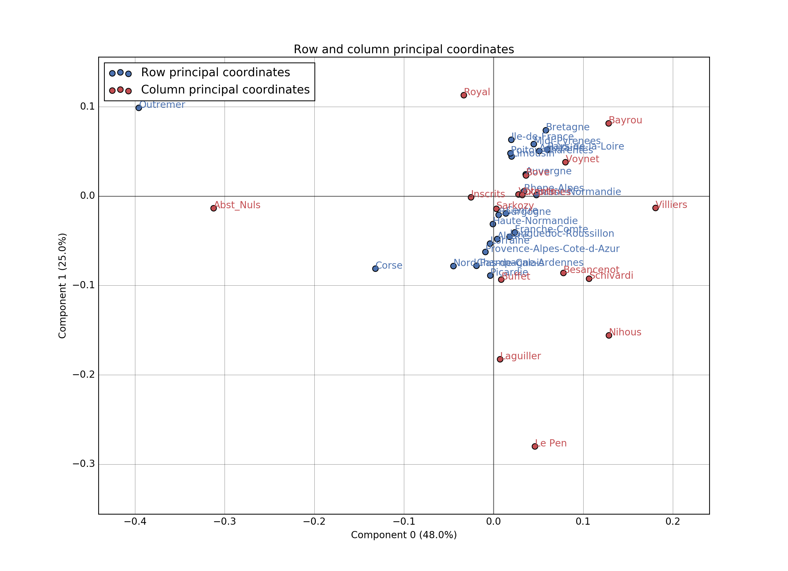
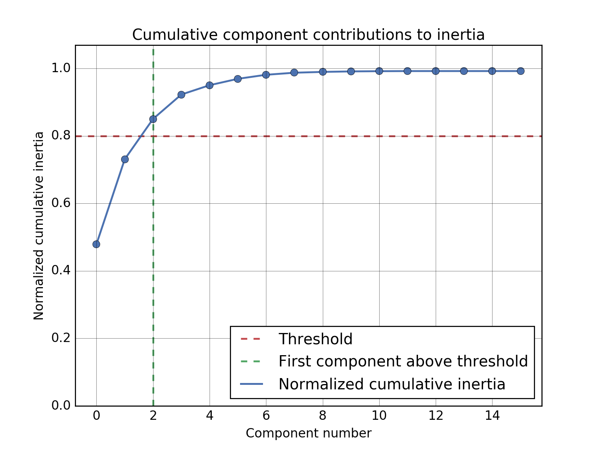

============================
Correspondance Analysis (CA)
============================

.. automodule:: prince.ca
    :members:
    :inherited-members:

-------------
Chart gallery
-------------

::

    import pandas as pd
    import prince

    df = pd.read_csv('data/presidentielles07.csv')
    pca = prince.CA(df, n_components=-1)

^^^^^^^^^^^^^^^^^^^^^^^^^^^^^^^^^^^^
Row and column principal coordinates
^^^^^^^^^^^^^^^^^^^^^^^^^^^^^^^^^^^^

::

    ca.plot_rows_columns(show_row_labels=True, show_column_labels=True)

^^^^^^^^^^^^^^^^^^
Cumulative inertia
^^^^^^^^^^^^^^^^^^

::

    ca.plot_cumulative_inertia(threshold=0.8)

