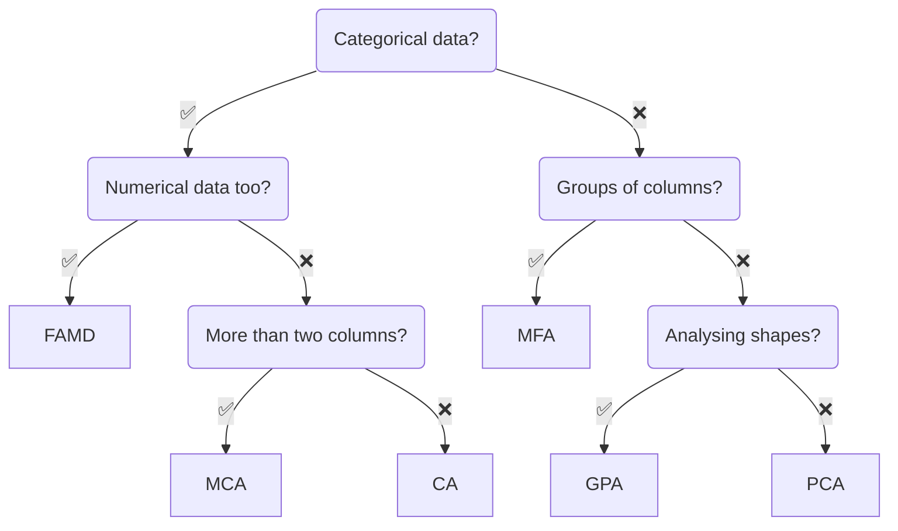

```mermaid
flowchart TD
    cat?(Categorical data?) --> |"✅"| num_too?(Numerical data too?)
    num_too? --> |"✅"| FAMD
    num_too? --> |"❌"| multiple_cat?(More than two columns?)
    multiple_cat? --> |"✅"| MCA
    multiple_cat? --> |"❌"| CA
    cat? --> |"❌"| groups?(Groups of columns?)
    groups? --> |"✅"| MFA
    groups? --> |"❌"| shapes?(Analysing shapes?)
    shapes? --> |"✅"| GPA
    shapes? --> |"❌"| PCA
    click PCA "/pca" "Principal component analysis"
    click CA "/ca" "Correspondence analysis"
    click MCA "/mca" "Principal component analysis"
    click MFA "/mfa" "Multiple factor analysis"
    click FAMD "/famd" "Factor analysis of mixed data"
    click GPA "/gpa" "Generalized Procrustes analysis"
```
