---
---

<div style="margin-top: 2em;"></div>

Prince is a Python library for multivariate exploratory data analysis in Python. It includes a variety of methods for summarizing tabular data, including principal component analysis and correspondence analysis. Prince provides efficient implementations, using a scikit-learn API.

## Methods

```mermaid
flowchart TD
    cat?(Categorical data?) --> |"✅"| num_too?(Numerical data too?)
    num_too? --> |"✅"| FAMD
    num_too? --> |"❌"| multiple_cat?(More than two columns?)
    multiple_cat? --> |"✅"| MCA
    multiple_cat? --> |"❌"| CA
    cat? --> |"❌"| groups?(Groups of columns?)
    groups? --> |"✅"| MFA
    groups? --> |"❌"| shapes?(Analysing shapes?)
    shapes? --> |"✅"| GPA
    shapes? --> |"❌"| PCA
```



## Installation

```sh
pip install prince
```

🎨 Prince uses [Altair](https://altair-viz.github.io/) for making charts.

## Correctness

Prince is tested against scikit-learn and [FactoMineR](http://factominer.free.fr/). For the latter, [rpy2](https://rpy2.github.io/) is used to run code in R, and convert the results to Python, which allows running automated tests. See more in the [`tests`](https://github.com/MaxHalford/prince/tree/master/tests) directory.

## Citation

Please use this citation if you use this software as part of a scientific publication.

```bibtex
@software{Halford_Prince,
    author = {Halford, Max},
    license = {MIT},
    title = {{Prince}},
    url = {https://github.com/MaxHalford/prince}
}
```

## About

I made Prince when I was at university, back in 2016. We used [FactoMineR](http://factominer.free.fr/) extensively in our labs, and so my initial motivation was to provide the same features for Python. I've had very little time over the years to maintain this package. I spent a significant of time in 2022 to revamp the entire package. Prince has now been downloaded over [2 million times](https://pepy.tech/project/prince).

## License

The MIT License (MIT). Please see the [license file](https://github.com/MaxHalford/prince/blob/master/LICENSE) for more information.
