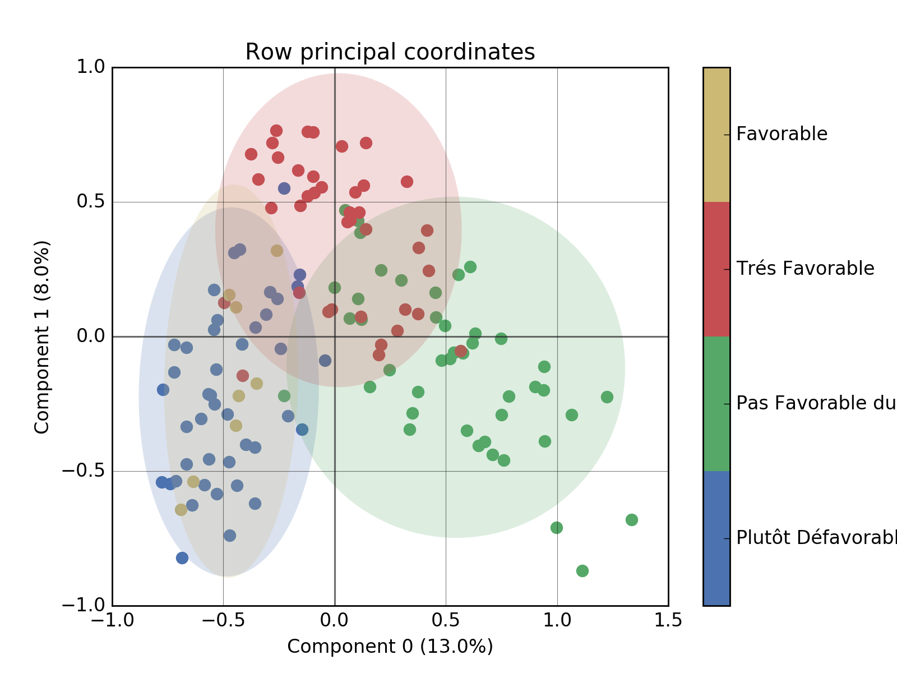
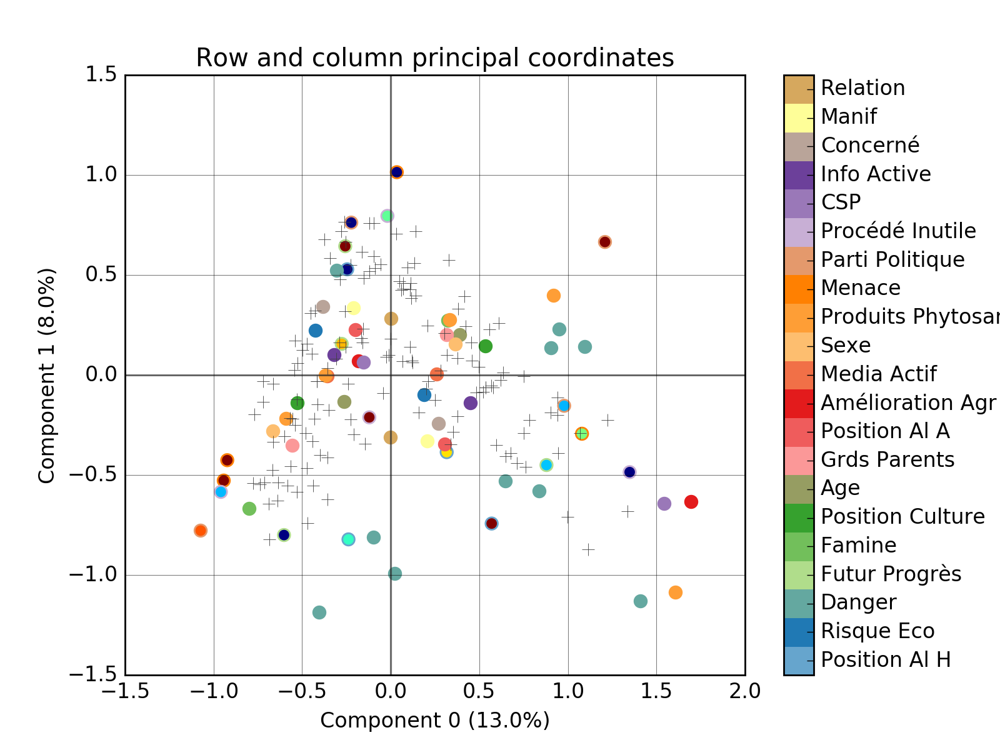
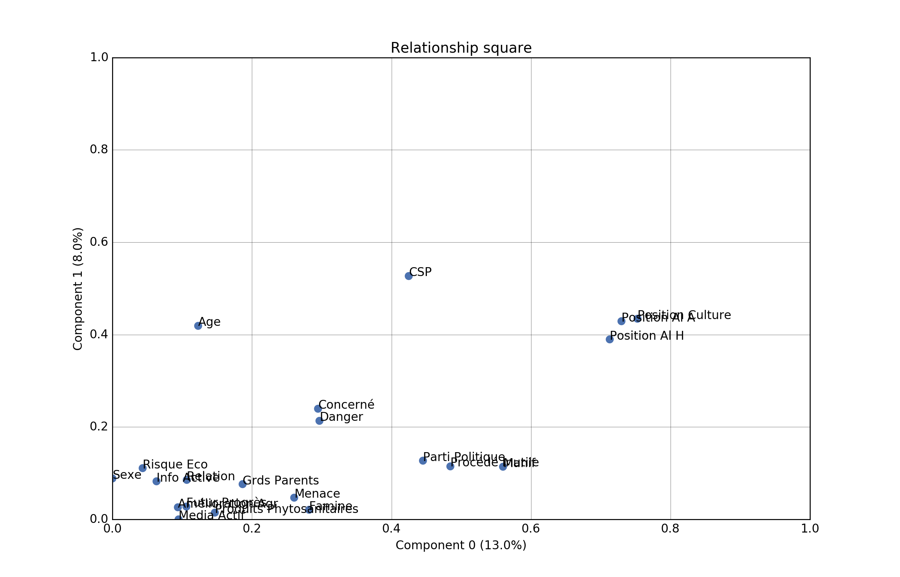
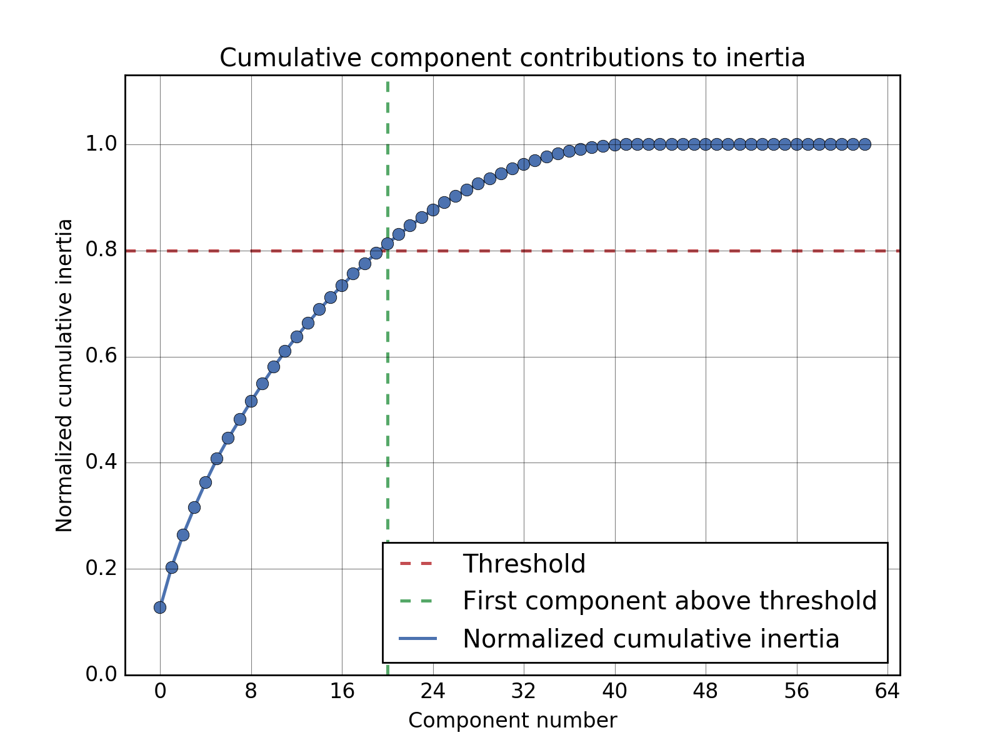

======================================
Multiple Correspondance Analysis (MCA)
======================================

.. automodule:: prince.mca
    :members:
    :inherited-members:

-------------
Chart gallery
-------------

::

    import pandas as pd
    import prince

    df = pd.read_csv('data/ogm.csv')
    mca = prince.MCA(df, n_components=-1)

^^^^^^^^^^^^^^^^^^^^^^^^^
Row principal coordinates
^^^^^^^^^^^^^^^^^^^^^^^^^

::

    mca.plot_rows(show_points=True, show_labels=False, color_by='Position Al A', ellipse_fill=True)

^^^^^^^^^^^^^^^^^^^^^^^^^^^^^^^^^^^^
Row and column principal coordinates
^^^^^^^^^^^^^^^^^^^^^^^^^^^^^^^^^^^^

::

    mca.plot_rows_columns()

^^^^^^^^^^^^^^^^^^^
Relationship square
^^^^^^^^^^^^^^^^^^^

::

    mca.plot_relationship_square()

^^^^^^^^^^^^^^^^^^
Cumulative inertia
^^^^^^^^^^^^^^^^^^

::

    mca.plot_cumulative_inertia(threshold=0.8)

