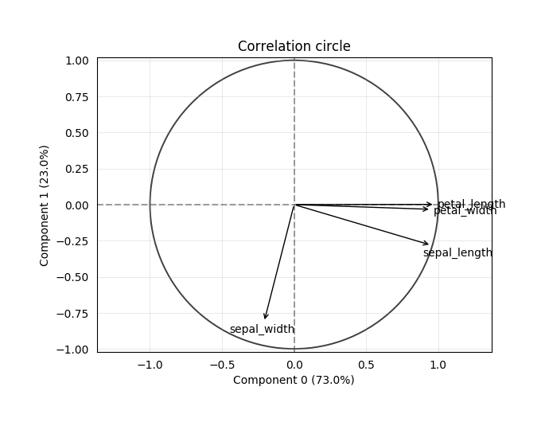

==================================
Principal Component Analysis (PCA)
==================================

.. automodule:: prince.pca
    :members:
    :inherited-members:

-------------
Chart gallery
-------------

The following charts are based on the `iris dataset <http://archive.ics.uci.edu/ml/datasets/Iris>`_. They are done with `Matplotlib <http://matplotlib.org/>`_.

::

    import pandas as pd
    import prince

    df = pd.read_csv('data/iris.csv')
    pca = prince.PCA(df, n_components=4)

^^^^^^^^^^^^^^^
Row projections
^^^^^^^^^^^^^^^

::

    pca.plot_rows(color_by='class', ellipse_fill=True)

.. image:: _static/pca_row_projections.png

^^^^^^^^^^^^^^^^^^
Correlation circle
^^^^^^^^^^^^^^^^^^

::

    pca.plot_correlation_circle()

^^^^^^^^^^^^^^^^^^
Cumulative inertia
^^^^^^^^^^^^^^^^^^

::

    pca.plot_cumulative_inertia(threshold=0.8)

.. image:: _static/pca_cumulative_inertia.png
